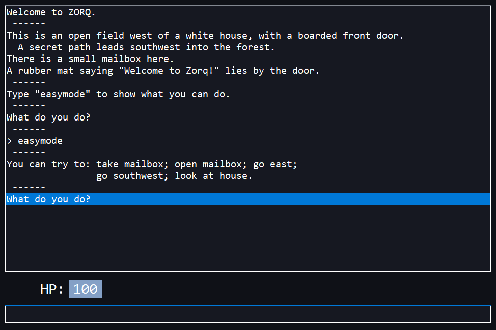

# zorq

Zorq is a text adventure game inspired by [Zork](https://github.com/historicalsource/zork1) for PDP-11.

Big thanks to [zork-py](https://github.com/iamjawa/zork-py/) for code inspiration and game's text lookup.

Made with Lazarus IDE on Pascal/Delphi.

